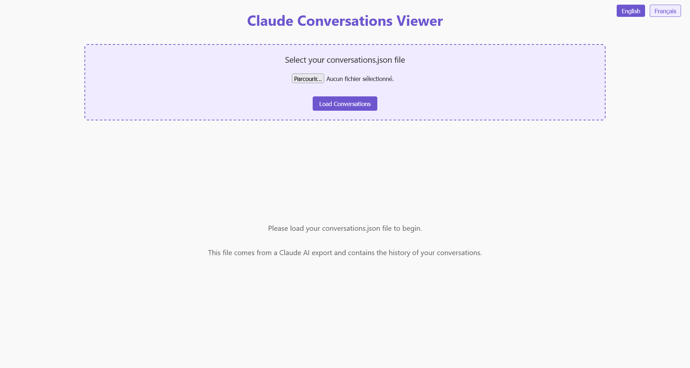
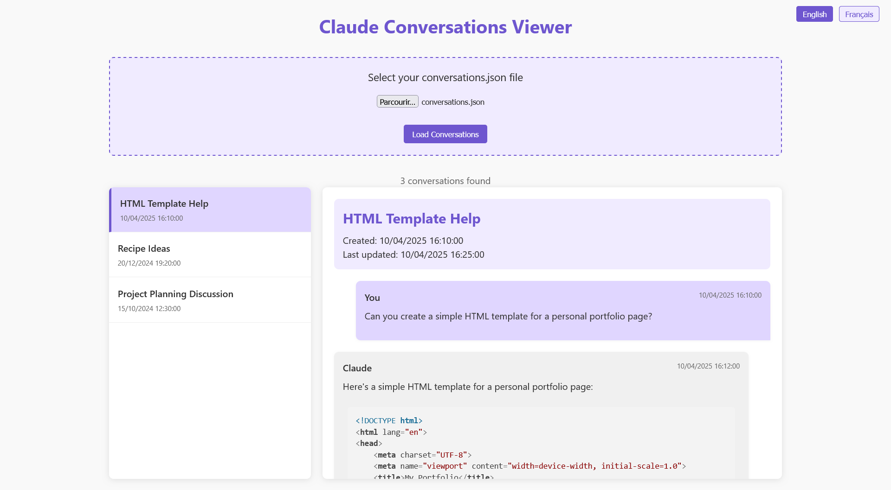

# Claude Conversations Viewer

  <a href="#english">English</a> | 
  <a href="#français">Français</a>

## English

This web application allows you to locally visualize and explore your Claude AI conversation history by loading your exported data file.

### Test it Online

You can directly test the application here: [https://nagarou-fr.github.io/claude-conversations-viewer/](https://nagarou-fr.github.io/claude-conversations-viewer/)

### Screenshots

*Application before loading a conversations file*

*Application with conversation history loaded*

### Features

- Completely client-side - your data never leaves your computer
- View all your conversations in chronological order
- Read complete conversation threads
- Proper rendering of markdown content
- Syntax highlighting for code blocks
- Display of artifacts created within conversations
- Clean, responsive UI that works on desktop and mobile

### How to Use

1. Visit the [online demo](https://nagarou-fr.github.io/claude-conversations-viewer/) or download this code and open the HTML file in your browser
2. Export your conversations from Claude AI (see instructions below)
3. Load your conversations.json file using the file input
4. Browse and read your conversation history

### How to Export Your Claude Data

To get your conversation history from Claude AI:

1. Log into Claude AI at https://claude.ai
2. Click on your initials in the bottom left corner of your account
3. Select "Settings" from the menu
4. Navigate to the "Privacy" section
5. Click on the "Export data" button
6. Wait for the export to be generated (you'll receive an email notification)
7. Open the email from Claude and click on the download link provided
8. Unzip the downloaded file
9. Find the "conversations.json" file in the extracted files - this is the file you'll load into the viewer

### Privacy

This application is completely client-side. When you load your conversations.json file:

- All processing happens locally in your browser
- No data is sent to any server
- No tracking or analytics is included

### Technical Details

The application is built with:

- Pure HTML, CSS, and JavaScript
- Marked.js for Markdown rendering
- highlight.js for syntax highlighting

### Limitations

- This viewer is designed specifically for Claude AI's export format
- Very large conversation files may cause performance issues in some browsers

### Contributing

Feel free to fork this repository and submit pull requests to improve the viewer. Some potential improvements:

- Add search functionality
- Add filtering options
- Improve artifact rendering
- Add conversation export/sharing features

### License

This project is open source and available under the MIT License.

---

## Français

Cette application web vous permet de visualiser et d'explorer localement l'historique de vos conversations avec Claude AI en chargeant votre fichier de données exporté.

### Tester en ligne

Vous pouvez tester directement l'application ici : [https://nagarou-fr.github.io/claude-conversations-viewer/](https://nagarou-fr.github.io/claude-conversations-viewer/)

### Captures d'écran

*Application avant le chargement d'un fichier de conversations*

*Application avec l'historique des conversations chargé*

### Fonctionnalités

- Entièrement côté client - vos données ne quittent jamais votre ordinateur
- Visualisation de toutes vos conversations par ordre chronologique
- Lecture des fils de conversation complets
- Rendu correct du contenu Markdown
- Coloration syntaxique pour les blocs de code
- Affichage des artefacts créés dans les conversations
- Interface utilisateur propre et responsive, fonctionnant sur ordinateur et mobile

### Comment Utiliser

1. Visitez la [démo en ligne](https://nagarou-fr.github.io/claude-conversations-viewer/) ou téléchargez ce code et ouvrez le fichier HTML dans votre navigateur
2. Exportez vos conversations depuis Claude AI (voir instructions ci-dessous)
3. Chargez votre fichier conversations.json à l'aide de l'entrée de fichier
4. Parcourez et lisez l'historique de vos conversations

### Comment Exporter Vos Données Claude

Pour obtenir l'historique de vos conversations depuis Claude AI :

1. Connectez-vous à Claude AI sur https://claude.ai
2. Cliquez sur vos initiales dans le coin inférieur gauche de votre compte
3. Sélectionnez "Paramètres" dans le menu
4. Naviguez jusqu'à la section "Confidentialité"
5. Cliquez sur le bouton "Exporter les données"
6. Attendez que l'exportation soit générée (vous recevrez une notification par email)
7. Ouvrez l'email de Claude et cliquez sur le lien de téléchargement fourni
8. Décompressez le fichier téléchargé
9. Trouvez le fichier "conversations.json" dans les fichiers extraits - c'est le fichier que vous chargerez dans la visionneuse

### Confidentialité

Cette application fonctionne entièrement côté client. Lorsque vous chargez votre fichier conversations.json :

- Tout le traitement se fait localement dans votre navigateur
- Aucune donnée n'est envoyée à un serveur
- Aucun suivi ni analyse n'est inclus

### Détails Techniques

L'application est construite avec :

- HTML, CSS et JavaScript purs
- Marked.js pour le rendu Markdown
- highlight.js pour la coloration syntaxique

### Limitations

- Cette visionneuse est conçue spécifiquement pour le format d'exportation de Claude AI
- Les fichiers de conversation très volumineux peuvent causer des problèmes de performance dans certains navigateurs

### Contribution

N'hésitez pas à forker ce dépôt et à soumettre des pull requests pour améliorer la visionneuse. Quelques améliorations potentielles :

- Ajouter une fonctionnalité de recherche
- Ajouter des options de filtrage
- Améliorer le rendu des artefacts
- Ajouter des fonctionnalités d'exportation/partage de conversations

### Licence

Ce projet est open source et disponible sous la licence MIT.